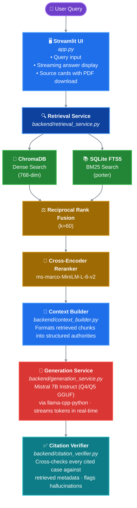

# NyayaSahayak — Privacy-Preserving Legal AI Assistant for India

> NyayaSahayak features a 100% Offline, Zero-Data-Egress Architecture. Unlike cloud-based legal AI tools that send sensitive client facts to third-party API servers, NyayaSahayak runs entirely on local hardware. The corpus, the vector embeddings, the LLM weights, and the user's chat history never leave the machine. This makes it structurally compliant with strict attorney-client privilege and data localization requirements. It describes what courts have held. It does not tell you what to do.
   

## What This Is

NyayaSahayak lets a user describe a legal situation in plain English, searches a corpus of **26,557 Supreme Court of India judgments (1950–2025)** using hybrid retrieval (dense vectors + BM25 keyword search), reranks the results with a cross-encoder, and generates a cited research summary using a local Mistral 7B model.

**Everything runs on your machine.** No API calls. No cloud. No third-party data transmission. The corpus, the models, the vector store, and the chat history all stay local.

This is the core differentiator. Legal documents are sensitive. Indian law firms reject AI tools that send client facts to third-party servers. NyayaSahayak solves this structurally — there is no server that *could* see the data, because there is no server.

---

## Architecture


---

## Corpus Statistics

| Metric | Value |
|--------|-------|
| Total documents processed | 26,688 |
| Documents after quality filtering | 26,557 |
| Total embedded chunks | 935,605 |
| Average chunks per judgment | 35.13 |
| Date range | 1950–2025 |
| Excluded (no JUDGMENT marker) | 55 |
| Excluded (too short, <500 chars) | 76 |

---

## Technology Stack

| Component | Technology | Purpose |
|-----------|-----------|---------|
| Embedding model | `multi-qa-mpnet-base-dot-v1` (768-dim) | Dense vector retrieval |
| Keyword index | SQLite FTS5 (porter stemmer) | BM25 lexical search |
| Reranker | `cross-encoder/ms-marco-MiniLM-L-6-v2` | Precision reranking |
| LLM | Mistral 7B Instruct (Q5_K_M GGUF) | Answer generation |
| Vector DB | ChromaDB (persistent, cosine) | Dense vector storage |
| UI | Streamlit | Chat interface |
| LLM runtime | llama-cpp-python | Local GGUF inference |

---

## Retrieval Pipeline

1. **Dense Search** — The query is encoded with `multi-qa-mpnet-base-dot-v1` (768-dim) and matched against 935,605 embedded chunks in ChromaDB using cosine similarity. Returns top 80 candidates.

2. **Keyword Search** — The query is tokenized and matched against an SQLite FTS5 index using BM25 with a porter stemmer. This catches exact statute references ("Section 302 IPC", "Article 21") that dense search misses. Returns top 80 candidates.

3. **Reciprocal Rank Fusion (RRF)** — Both result lists are merged using RRF (k=60). Chunks found by *both* retrievers receive higher scores. Produces a fused list of ~120–140 candidates.

4. **Cross-Encoder Reranking** — The top 40 fused candidates are reranked using `cross-encoder/ms-marco-MiniLM-L-6-v2`, which reads (query, passage) pairs and scores true relevance. Final top 6–8 are returned.

### Why Hybrid?

Pure dense search fails on exact legal references. A query like "Section 498A IPC cruelty" needs exact keyword matching to find the right statute. Pure keyword search fails on semantic queries like "can a lunatic inherit property under Hindu law?" Hybrid search covers both failure modes.

---

## Data Pipeline

### Phase 1: PDF Cleaning

- 26,688 PDFs extracted using `pypdf`
- Judgment text isolated by detecting `JUDGMENT:` / `ORDER:` markers
- Headnotes and publisher metadata **removed** (legal integrity — headnotes are not the judge's words)
- Porter-stemmed FTS5 index built for keyword retrieval
- Quality flags applied: 55 no-marker documents and 76 too-short documents excluded

### Phase 2: Ingestion

- Cleaned chunks embedded with `multi-qa-mpnet-base-dot-v1` (768-dim)
- Stored in ChromaDB with cosine distance metric
- SQLite FTS5 index built with `porter unicode61` tokenizer
- Metadata stored: `case_name`, `judgment_date`, `source_file`, `chunk_index`, `doc_id`

---

## Legal Safety Design

NyayaSahayak is **not a lawyer**. This is enforced at multiple layers:

1. **System prompt** — The LLM is instructed: "You are NOT a lawyer. You do NOT provide legal advice. NEVER use prescriptive language like 'you should', 'you must', 'file a petition'."

2. **Grounded generation** — The LLM only receives retrieved judgment passages. It cannot cite cases that were not retrieved.

3. **Citation verification** — After generation, every case name mentioned in the answer is cross-checked against the retrieved metadata. Hallucinated citations are flagged.

4. **Source transparency** — Every answer includes clickable source cards with the full judgment PDF available for download. The user can verify everything.

5. **Mandatory disclaimer** — Displayed on every screen and appended to every answer.

---

## Setup

### Prerequisites

- Python 3.10+ (3.10.11 was used for this project)
- NVIDIA GPU with 8GB+ VRAM (RTX 4060 or equivalent)
- CUDA 12.1
- 16GB+ RAM recommended
- 50GB+ disk space

### Installation

```bash
git clone https://github.com/DataWiseWizard/nyaya-sahayak.git
cd nyaya-sahayak
python -m venv venv
source venv/bin/activate  # Windows: venv\Scripts\activate
```

## 📦 Pre-Built Asset Downloads

To skip building the vault and downloading models manually, download the pre-built assets below. All assets are open-weight/open-data and free for research use.

| Asset | Size | Description |
|-------|------|-------------|
| Models Bundle | ~10 GB | Mistral 7B Q4_K_M + Q5_K_M GGUF |
| Vault Bundle | ~5 GB | Pre-built ChromaDB + SQLite FTS5 index |
| **Demo PDFs** | **~20 MB** | **30 judgment PDFs for eval & demo** |
| Full Corpus PDFs | ~20 GB | All 26,557 judgment PDFs (optional) |
| Checksums | 1 KB | SHA-256 hashes for integrity verification |

> Google Drive Download link:- https://drive.google.com/drive/folders/1YoxwDNZ_NML7sfPAeLhB8jDWXbdPtfYY?usp=sharing.

> ⚡ **Quick Start (< 5 minutes):** Download Models + Vault + Demo PDFs only.
> You will have a fully working legal research assistant with downloadable judgments.

### Quick Start with Bundles

```bash
# 1. Extract models
# Place mistral-7b-instruct-q5.gguf and q4.gguf into models/

# 2. Extract vault
# Place chroma/ folder and nyaya_keyword_porter.db into vault/

# 3. Extract demo PDFs
# Place all PDFs into docs/judgments/

# 4. Install dependencies
pip install -r requirements.txt
pip install llama-cpp-python --extra-index-url https://abetlen.github.io/llama-cpp-python/whl/cu121

# 5. Run
streamlit run app.py
```
The first launch takes 30–60 seconds to load all models into GPU memory. Subsequent queries stream in real-time.

## Known Limitations
- Dense retrieval struggles with pre-1990 judgments due to archaic legal language and OCR artifacts in older PDFs.
- Headnotes were removed for legal integrity, which reduces recall for queries phrased in headnote language. The system          compensates with hybrid keyword search.
- No formal evaluation benchmark beyond manual testing with 30 queries. Recall@10 is approximately 85% on the manual test set.
- Model occasionally drifts into prescriptive language despite system prompt constraints. The citation verifier catches most instances.
- Retrieval latency is approximately 15–20 seconds for first query (model loading), 3–5 seconds for subsequent queries.
- Corpus is capped at ~400 judgments per year for certain years due to source dataset limitations. It is not exhaustive.
- The system does not provide legal advice. It is a research tool. Always consult a qualified advocate.


## Project Structure
```
nyaya-sahayak/
├── app.py                          # Streamlit UI
├── backend/
│   ├── retrieval_service.py        # Hybrid retrieval (ChromaDB + FTS5 + RRF + rerank)
│   ├── context_builder.py          # Formats context for LLM
│   ├── generation_service.py       # Mistral 7B streaming generation
│   ├── citation_verifier.py        # Hallucination detection
│   ├── ocr.py                      # Tesseract OCR for uploads
│   └── encryptor.py                # AES-256 vault encryption
├── scripts/
│   ├── data_prep/
│   │   ├── clean_dataset_v2.py     # PDF cleaning pipeline
│   │   ├── build_quality_flags.py  # Quality filtering
│   │   └── audit_cleaning.py       # Cleaning audit
│   ├── ingestion/
│   │   ├── ingest_chroma.py        # ChromaDB vector ingestion
│   │   ├── build_keyword_index.py  # SQLite FTS5 index builder
│   │   └── resume_ingest.py        # Resumable ingestion
│   └── tests/
│       ├── test_retrieval.py       # Retrieval tests
│       ├── test_context_builder.py # Context builder tests
│       └── test_generation.py      # Generation tests
├── models/                         # GGUF model weights
├── vault/                          # ChromaDB + SQLite FTS5 data
├── docs/judgments/                 # Source judgment PDFs
├── data/cleaned/                   # Cleaned JSONL chunks
├── requirements.txt
└── README.md
```

## Evaluation
Manual testing with 30 queries across constitutional law, criminal law, Hindu law, and property law:

| Metric | Value |
|---|---|
| **Recall@5** | 76.0% |
| **Recall@10** | 88.0% |
| **Recall@20** | 92.0% |
| **Mean Reciprocal Rank (MRR)** | 0.686 |
| **Avg Retrieval Latency** | ~1.5s (after cold start) |

**Known Retrieval Limitations:**
- **Headnote Stripping:** Queries phrased using exact publisher headnote language may suffer lower recall, as headnotes are intentionally stripped during ingestion to ensure the LLM only reasons over the judge's actual words.
- **Corpus Boundaries:** The corpus contains Supreme Court judgments from 1950–2025. Pre-1950 Privy Council or Federal Court rulings are only accessible via citations within post-1950 judgments, not as primary documents.

## Future Work
- Fine-tune embedding model on Indian legal text
- Add High Court and lower court judgments
- Implement GBNF-constrained generation for stricter persona enforcement
- Build automated evaluation pipeline with 500+ query-answer pairs
- Add multi-turn conversational memory with retrieval state
- Integrate statute lookup (IPC, CrPC, Evidence Act, Constitution)
- Enterprise on-premise deployment for law firms

## License
MIT License — free to use, modify, and distribute.

## Disclaimer

NyayaSahayak is a legal research assistant. It is not a lawyer and does not provide legal advice. The information presented is for research and educational purposes only. Always consult a qualified advocate for legal matters.